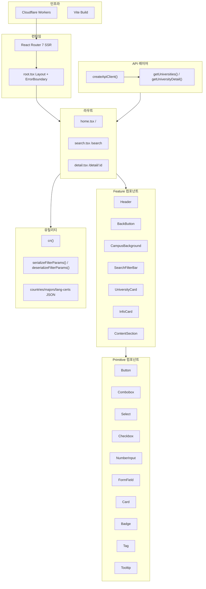
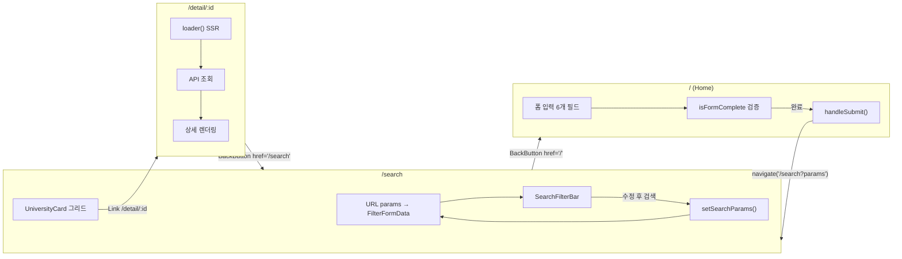
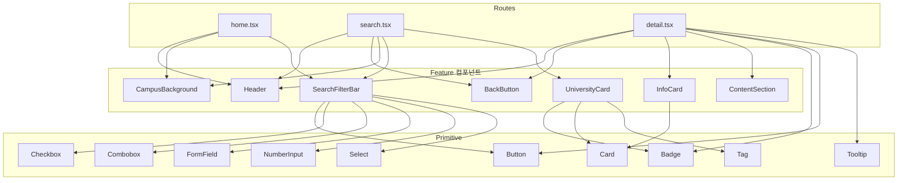
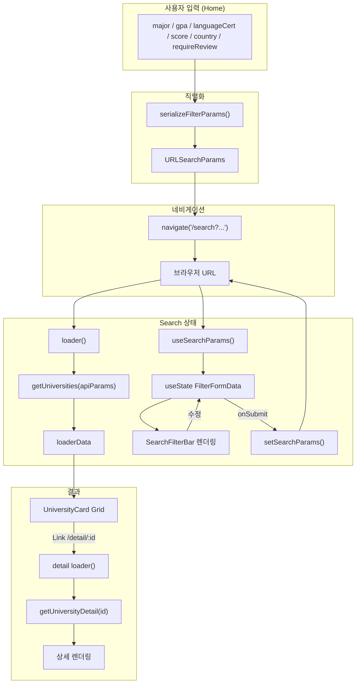
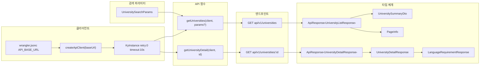
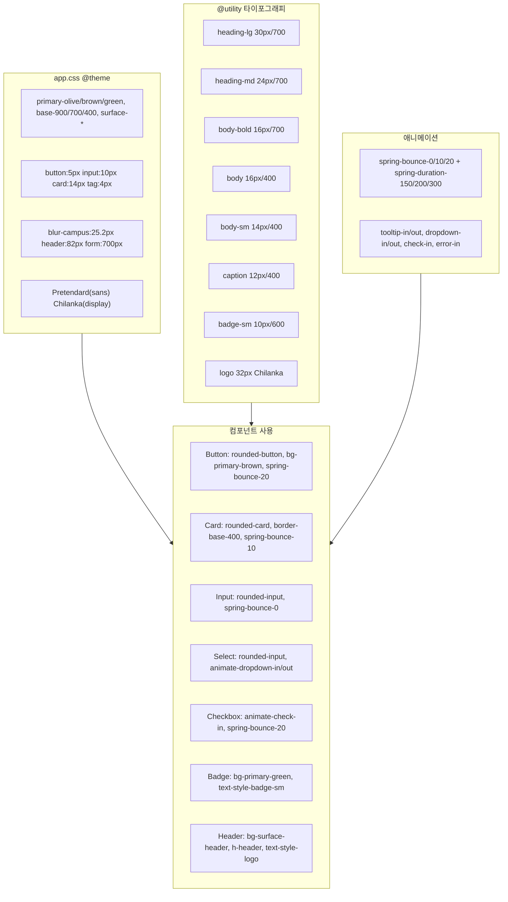

# Beyond U - 아키텍처 다이어그램

## 1. 전체 아키텍처 개요

Cloudflare Workers 위 React Router 7 SSR 구조, 라우트/컴포넌트/API/유틸리티/스타일 레이어 간 관계.

## 2. 라우트 & 네비게이션 플로우

## 3. 컴포넌트 의존성 그래프

## 4. 데이터 플로우

## 5. API 레이어 구조

## 6. 디자인 시스템 토큰 맵

