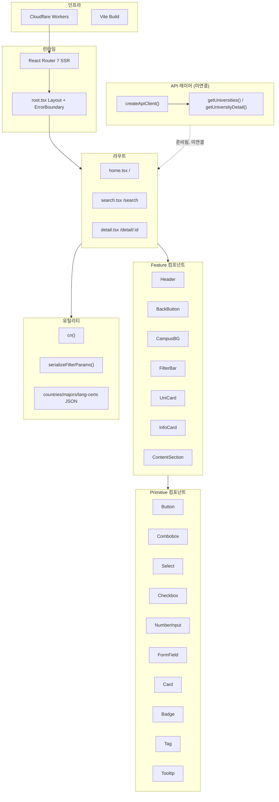
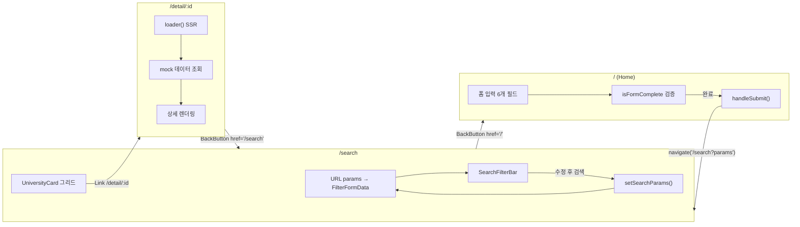
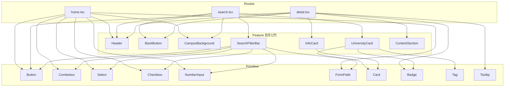
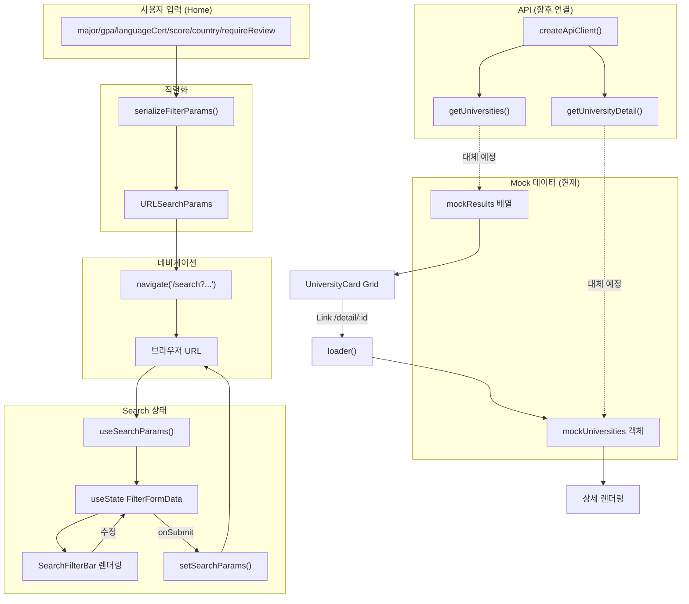
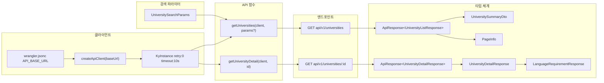
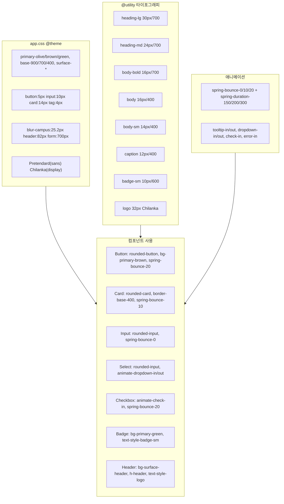

# Beyond U Client - 내부 구조 문서화 및 코드 개선 계획

## Context

Beyond U는 교환학생 준비 가이드 앱으로, React Router 7 + Cloudflare Workers + TailwindCSS 4 기반이다. 현재 3개 라우트(Home, Search, Detail)가 존재하며, API 클라이언트와 함수가 준비되어 있으나 모든 라우트가 하드코딩된 mock 데이터를 사용 중이다. 이 계획은 (1) 프로젝트 내부 구조를 Mermaid 다이어그램으로 문서화하고, (2) 코드 구조 개선 사항을 식별하여 정리하는 것을 목표로 한다.

---

## Part 1: Mermaid 구조 문서

`docs/architecture.md` 파일을 생성하여 아래 6개 다이어그램을 포함한다.

### 1-1. 전체 아키텍처 개요

Cloudflare Workers 위 React Router 7 SSR 구조, 라우트/컴포넌트/API/유틸리티/스타일 레이어 간 관계를 표현한다.



### 1-2. 라우트 & 네비게이션 플로우



### 1-3. 컴포넌트 의존성 그래프



### 1-4. 데이터 플로우



### 1-5. API 레이어 구조



### 1-6. 디자인 시스템 토큰 맵



---

## Part 2: 코드 구조 개선 계획

### Phase 1 - 기반 작업 (Quick Wins)

#### 1-1. FilterFormData 파싱/직렬화 유틸리티 통합
- **문제**: `serialize-filter-params.ts`에 직렬화만 존재. `search.tsx:94-101`에 역직렬화가 인라인으로 있음. API 연동 시 `FilterFormData → UniversitySearchParams` 변환도 필요
- **변경**:
  - `app/lib/serialize-filter-params.ts` → `app/lib/filter-params.ts`로 이름 변경
  - 3개 함수 통합: `serializeFilterParams()`, `deserializeFilterParams()`, `toSearchApiParams()`
  - `search.tsx`의 인라인 역직렬화 코드를 `deserializeFilterParams()` 호출로 교체
- **파일**: `app/lib/serialize-filter-params.ts` → `app/lib/filter-params.ts`, `app/routes/search.tsx`, `app/routes/home.tsx`

#### 1-2. Home 라우트의 인라인 폼을 SearchFilterBar로 교체
- **문제**: `home.tsx:76-141`에 FormField/Combobox/NumberInput/Select/Checkbox 조합 폼이 인라인으로 있음. `SearchFilterBar`와 동일한 필드 구성이 중복됨
- **변경**:
  - 6개 개별 `useState`를 `useState<FilterFormData>` 1개로 통합
  - `SearchFilterBar`에 `variant?: "compact" | "full"` prop 추가 (compact=Search용 3열, full=Home용 2열)
  - Home의 인라인 폼을 `<SearchFilterBar variant="full" ... />` 호출로 교체
  - Home 고유 요소(제목, CTA 버튼, 유효성 메시지)는 외부에 유지
- **파일**: `app/routes/home.tsx`, `app/shared/components/search-filter-bar.tsx`

#### 1-3. SearchFilterBar 상수 내부 import + prop 통합
- **문제**: `home.tsx`와 `search.tsx` 모두 countries/majors/language-certificates JSON을 독립 import하여 prop으로 전달. SearchFilterBar의 12개 개별 prop이 사용부를 장황하게 만듦
- **변경**:
  - SearchFilterBar 내부에서 상수를 직접 import → `majorSuggestions`, `countrySuggestions`, `languageCertOptions` prop 제거
  - 12개 개별 value/onChange prop을 `filters: FilterFormData` + `onFiltersChange: (filters) => void`로 통합
- **파일**: `app/shared/components/search-filter-bar.tsx`, `app/routes/home.tsx`, `app/routes/search.tsx`

### Phase 2 - API 연동

#### 2-1. Detail 라우트 loader API 연동
- **문제**: `detail.tsx`에 `mockUniversities` 객체가 하드코딩됨. 기존 loader 구조가 잡혀있어 API 교체만 필요
- **변경**:
  - `mockUniversities` 삭제, loader에서 `createApiClient()` + `getUniversityDetail()` 호출
  - `context.cloudflare.env.API_BASE_URL`로 base URL 획득
  - HTTPError 404 → `throw new Response("Not Found", { status: 404 })` 변환
- **파일**: `app/routes/detail.tsx`

#### 2-2. Search 라우트 loader API 연동
- **문제**: `search.tsx:28-89`에 5개 대학 mock 배열이 하드코딩됨
- **변경**:
  - `loader` 함수 추가: URL params → `deserializeFilterParams()` → `toSearchApiParams()` → `getUniversities()` 호출
  - `mockResults` 삭제, `loaderData.universities`로 결과 렌더링
  - 결과 카운트를 `loaderData.pageInfo.totalElements`로 교체
  - 컴포넌트 시그니처를 `Search({ loaderData }: Route.ComponentProps)`로 변경
- **파일**: `app/routes/search.tsx`

### Phase 3 - UX 개선

#### 3-1. 로딩 상태
- `useNavigation().state === "loading"` 감지하여 결과 영역 흐리게 + 버튼 비활성화
- **파일**: `app/routes/search.tsx`

#### 3-2. 빈 결과 상태 및 라우트별 ErrorBoundary
- 검색 결과 0건 시 "조건에 맞는 학교가 없습니다" 빈 상태 UI 표시
- `search.tsx`, `detail.tsx`에 `ErrorBoundary` export 추가 (404 vs 500 분기, 재시도 버튼)
- **파일**: `app/routes/search.tsx`, `app/routes/detail.tsx`

#### 3-3. 페이지네이션
- `app/shared/ui/primitives/pagination.tsx` 신규 생성
- URL params에 `page` 추가, loader에서 API로 전달
- **파일**: `app/shared/ui/primitives/pagination.tsx` (신규), `app/routes/search.tsx`, `app/lib/filter-params.ts`

### Phase 4 - 장기 개선

#### 4-1. API 에러 핸들링 레이어
- `createApiClient`에 afterResponse 훅으로 공통 에러 로깅 추가
- loader 에러 변환 패턴을 `handleApiError()` 유틸로 추출

#### 4-2. Detail 뒤로가기 시 검색 상태 보존
- `UniversityCard`에서 `Link` state로 현재 검색 URL 전달
- `detail.tsx`에서 `useLocation().state?.from`으로 BackButton href 설정

---

## 실행 전략: 에이전트 팀 위임

메인 에이전트가 팀을 생성하고, 각 Phase를 독립 에이전트에게 위임한다. Phase 간 의존 관계가 있으므로 순차적으로 진행한다.

### 팀 구성

| 에이전트 | 역할 | 담당 |
|---|---|---|
| **lead** (메인) | 팀 리더, 작업 생성/할당, Phase 간 조율 | 전체 조율 + Part 1 문서화 |
| **agent-foundation** | Phase 1 전담 | filter-params 통합, SearchFilterBar 리팩터링, Home 폼 교체 |
| **agent-api** | Phase 2 전담 | Detail/Search loader API 연동 |
| **agent-ux** | Phase 3 전담 | 로딩 상태, ErrorBoundary, 빈 결과, 페이지네이션 |

### 실행 순서, 파일 소유권, 커밋/리뷰 파이프라인

각 하위 작업은 수정하는 파일이 명확하게 구분되어 충돌하지 않도록 한다. 하위 작업 완료 시마다 **커밋 → `/review` 실행** 파이프라인을 수행한다.

```
Step 0: lead가 Part 1 Mermaid 문서 생성
        파일: docs/architecture.md (신규)
        → 커밋: "docs: add architecture mermaid diagrams"
        → /review
        ↓
Step 1: agent-foundation Phase 1 수행
        1-1: filter-params 유틸리티 통합
             파일: app/lib/serialize-filter-params.ts → app/lib/filter-params.ts
                   app/routes/search.tsx (import 경로만)
                   app/routes/home.tsx (import 경로만)
             → 커밋: "refactor: unify filter param serialization/deserialization utilities"
             → /review

        1-2: Home 폼 → SearchFilterBar 교체 + 상수 내부 import + prop 통합
             파일: app/shared/components/search-filter-bar.tsx (variant 추가, 상수 내부화, prop 통합)
                   app/routes/home.tsx (인라인 폼 → SearchFilterBar, state 통합)
                   app/routes/search.tsx (새 prop 인터페이스에 맞게 호출부 수정)
             → 커밋: "refactor: deduplicate filter form by reusing SearchFilterBar across routes"
             → /review
        ↓
Step 2: agent-api Phase 2 수행
        2-1: Detail loader API 연동
             파일: app/routes/detail.tsx (mock 삭제, API loader)
             → 커밋: "feat: connect detail page to university detail API"
             → /review

        2-2: Search loader API 연동
             파일: app/routes/search.tsx (mock 삭제, API loader, loaderData 사용)
             → 커밋: "feat: connect search page to universities list API"
             → /review
        ↓
Step 3: agent-ux Phase 3 수행
        3-1: 로딩 상태 + 빈 결과 + ErrorBoundary
             파일: app/routes/search.tsx (로딩, 빈 결과)
                   app/routes/detail.tsx (ErrorBoundary)
             → 커밋: "feat: add loading states, empty results, and error boundaries"
             → /review

        3-2: 페이지네이션
             파일: app/shared/ui/primitives/pagination.tsx (신규)
                   app/routes/search.tsx (Pagination 배치)
                   app/lib/filter-params.ts (page 파라미터 추가)
             → 커밋: "feat: add pagination to search results"
             → /review
```

**파일 소유권 규칙**: 각 Step은 순차 실행되므로 동일 파일을 다른 에이전트가 동시에 수정하는 상황은 발생하지 않는다. Step 내에서 하위 작업도 순차 실행한다.

**커밋/리뷰 파이프라인**: 각 하위 작업 완료 후:
1. `pnpm build` 성공 확인
2. 변경 파일을 staging
3. 커밋 생성 (GPG 서명 위해 `dangerouslyDisableSandbox: true`)
4. `/review` 스킬 실행 (별도 sub-agent에서)

Phase 4 (장기 개선)는 이번 팀 실행 범위에서 제외하고, 별도 작업으로 진행한다.

### 각 에이전트에게 전달할 세부 컨텍스트

#### agent-foundation (Phase 1)

**작업 1-1: filter-params 유틸리티 통합**
- `app/lib/serialize-filter-params.ts`를 `app/lib/filter-params.ts`로 이름 변경
- 기존 `serializeFilterParams()` 유지
- `deserializeFilterParams(params: URLSearchParams): FilterFormData` 추가 — 현재 `search.tsx:94-101`의 인라인 로직을 함수로 추출
- `toSearchApiParams(filters: FilterFormData): UniversitySearchParams` 추가 — FilterFormData → API 파라미터 변환
- 기존 import 경로(`~/lib/serialize-filter-params`) 사용처를 `~/lib/filter-params`로 업데이트
- `search.tsx`에서 인라인 역직렬화 코드를 `deserializeFilterParams()` 호출로 교체
- 커밋 후 `/review` 실행

**작업 1-2: SearchFilterBar 리팩터링 + Home 폼 교체 (1-2와 1-3 통합)**
- `search-filter-bar.tsx` 변경:
  - 내부에서 상수를 직접 import (`countries.json`, `majors.json`, `language-certificates.json`)
  - `majorSuggestions`, `countrySuggestions`, `languageCertOptions` prop 제거
  - 12개 개별 prop → `filters: FilterFormData` + `onFiltersChange: (filters: FilterFormData) => void` + `onSubmit: () => void` + `variant` + `className`으로 통합
  - `variant?: "compact" | "full"` prop 추가
    - `"compact"` (기본값): 3열 그리드 + 버튼 포함
    - `"full"`: 2열 그리드 + 버튼 없음 (Home에서 자체 CTA 사용)
- `home.tsx` 변경:
  - 6개 개별 `useState` → `useState<FilterFormData>` 1개로 통합
  - `isFormComplete` 로직은 `filters` 객체에서 파생
  - 인라인 폼(76~141행) → `<SearchFilterBar variant="full" ... />` 교체
  - Home 고유 UI(제목, 에러 메시지, CTA 버튼)는 외부에 유지
  - 상수 import 제거
- `search.tsx` 변경:
  - 새 prop 인터페이스에 맞게 호출부 수정
  - 상수 import 제거
- 커밋 후 `/review` 실행

#### agent-api (Phase 2)

**작업 2-1: Detail loader API 연동**
- `detail.tsx`의 `mockUniversities` 객체 (14~78행) 삭제
- loader 함수를 다음으로 교체:
  ```typescript
  import { HTTPError } from "ky";
  import { createApiClient, getUniversityDetail } from "~/shared/api";

  export async function loader({ params, context }: Route.LoaderArgs) {
    const id = Number(params.id);
    if (Number.isNaN(id)) throw new Response("Not Found", { status: 404 });

    const client = createApiClient(context.cloudflare.env.API_BASE_URL);
    try {
      const response = await getUniversityDetail(client, id);
      return { university: response.result };
    } catch (error) {
      if (error instanceof HTTPError && error.response.status === 404) {
        throw new Response("Not Found", { status: 404 });
      }
      throw error;
    }
  }
  ```
- 컴포넌트 코드는 이미 `loaderData.university`를 `UniversityDetailResponse`로 사용하므로 변경 불필요
- 커밋 후 `/review` 실행

**작업 2-2: Search loader API 연동**
- `search.tsx`의 `mockResults` 배열 (28~89행) 삭제
- `loader` 함수 추가:
  ```typescript
  import { createApiClient, getUniversities } from "~/shared/api";
  import { deserializeFilterParams, toSearchApiParams } from "~/lib/filter-params";

  export async function loader({ request, context }: Route.LoaderArgs) {
    const url = new URL(request.url);
    const filters = deserializeFilterParams(url.searchParams);
    const apiParams = toSearchApiParams(filters);

    const client = createApiClient(context.cloudflare.env.API_BASE_URL);
    const response = await getUniversities(client, apiParams);

    return {
      universities: response.result.universities,
      pageInfo: response.result.pageInfo,
      filters,
    };
  }
  ```
- 컴포넌트 시그니처를 `Search({ loaderData }: Route.ComponentProps)`로 변경
- `loaderData.universities`로 카드 렌더링, `loaderData.pageInfo.totalElements`로 결과 카운트
- `loaderData.filters`로 폼 초기값 설정
- 로컬 `filters` 상태는 유지 (사용자가 폼 수정 후 검색 버튼 클릭 시에만 URL 업데이트)
- 커밋 후 `/review` 실행

#### agent-ux (Phase 3)

**작업 3-1: 로딩 상태 + 빈 결과 + ErrorBoundary**
- `search.tsx`에서 `useNavigation()` import, `navigation.state === "loading"` 감지
- 결과 그리드에 `opacity-50 pointer-events-none` 조건부 클래스 적용
- SearchFilterBar의 submit 버튼에 로딩 중 `disabled` 상태 전달
- `universities.length === 0`일 때 빈 상태 UI 표시 ("조건에 맞는 학교가 없습니다")
- `search.tsx`, `detail.tsx`에 `ErrorBoundary` 함수 export 추가
  - `isRouteErrorResponse(error)` 분기: 404 → "페이지를 찾을 수 없습니다", 그 외 → "오류가 발생했습니다"
  - 홈으로 돌아가기 링크 포함
- 커밋 후 `/review` 실행

**작업 3-2: 페이지네이션**
- `app/shared/ui/primitives/pagination.tsx` 신규 생성
  - props: `currentPage: number`, `totalPages: number`, `onPageChange: (page: number) => void`
  - 이전/다음 버튼 + 페이지 번호 목록
  - 프로젝트 디자인 토큰 사용 (rounded-button, text-style-body, primary-brown 등)
- `search.tsx`: 결과 그리드 아래에 Pagination 배치
  - `loaderData.pageInfo`에서 currentPage, totalPages 전달
  - 페이지 변경 시 URL params에 `page` 추가 → `setSearchParams` → loader 재실행
- 커밋 후 `/review` 실행

### 검증 방법

각 에이전트는 자신의 Phase 완료 후 다음을 수행:
1. `pnpm build` — 빌드 성공 확인
2. Biome lint/format 통과 확인 (`pnpm biome check`)
3. 변경 파일의 import 경로 정합성 확인

전체 검증:
- **Part 1**: `docs/architecture.md`가 GitHub에서 Mermaid 렌더링되는지 확인
- **Phase 1**: SearchFilterBar가 Home/Search 양쪽에서 정상 작동하는지 수동 확인
- **Phase 2**: Swagger(`api.beyondu.yourssu.com/v3/api-docs`)와 응답 타입 일치 검증
- **Phase 3**: DevTools 네트워크 throttling으로 로딩 상태, 존재하지 않는 ID로 ErrorBoundary, 결과 없는 검색으로 빈 상태 확인

---

## Critical Files

| 파일 | 역할 |
|---|---|
| `app/lib/serialize-filter-params.ts` | 필터 직렬화 → filter-params.ts로 확장 |
| `app/routes/search.tsx` | mock 제거, loader 추가, 가장 큰 변경 |
| `app/routes/detail.tsx` | mock 제거, loader API 연동 |
| `app/routes/home.tsx` | 인라인 폼 → SearchFilterBar 교체 |
| `app/shared/components/search-filter-bar.tsx` | variant 추가, prop 통합, 상수 내부화 |
| `app/shared/api/types.ts` | 전체 API 타입 정의 |
| `app/app.css` | 디자인 시스템 토큰 |
